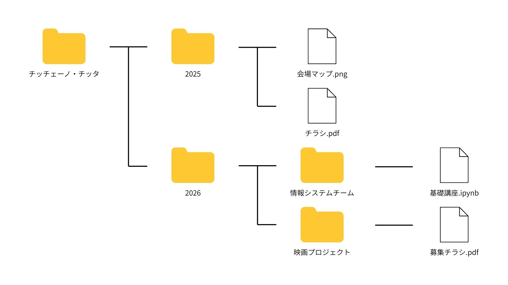

# ファイル操作

## エクスプローラーの設定変更

`エクスプローラー > 表示 > 表示 > ファイル名拡張子`をONにする。


`画像.png`の`png`を拡張子という。デフォルトでは非表示になっているが、プログラミングをする上では表示されていた方が便利。

## 基礎知識

### フォルダ構成

フォルダ・ファイルは以下のような入れ子構造になっている。



上のフォルダ構成をテキストで以下のように表すこともある。

```
チッチェーノ・チッタ
├─2025
│　├─会場マップ.png
│　└─チラシ.pdf
└─2026
 　├─情報システムチーム
 　│　└─基礎講座.ipynb
 　└─映画プロジェクト
 　 　└─募集チラシ.pdf
```

今後は簡略のためにこの表記で統一する。

### パス

特定のファイルへのアドレスを **パス** という形式で表すことがある。
上の例において、 *募集チラシ.pdf* は `チッチェーノ・チッタ/2026/映画プロジェクト/募集チラシ.pdf` となる。

このページへのリンク(`https://cicceno-citta.github.io/starter/2026/PC基礎講座&顔合わせ/PC基礎講座/ファイル操作.html`)の後半部分(`starter/2026/PC基礎講座&顔合わせ/PC基礎講座/ファイル操作.html`)もパスである。

### Windowsのフォルダ構成

Windowsを使用している場合、デフォルトで以下のようなフォルダ構成が存在する。

```
C:
├─Users
│　├─(ユーザー名)
│　│　├─Downloads
│　│　├─Desktop
│　│　├─Documents
│　│　├─Pictures
│　│　├─Videos
│　│　├─Music
```

この例において、`C:`を **ドライブレター** といい、ドライブレターから始まるパスを **絶対パス** と呼ぶ。`Downloads`フォルダへの絶対パスは `C:\Users\glyzi\Downloads` である。

絶対パスは、エクスプローラーのアドレスバーからコピー、また入力することでそのファイルに移動することができる。


## ファイル操作

### コピー

[クリップボード](用語集.md#クリップボード)に保存する。

ファイルを選択した状態で `右クリック > コピー` をクリックする。


### 切り取り

クリップボードに保存したうえで元のファイルを削除する。

ファイルを選択した状態で `右クリック > 切り取り` をクリックする。

### 貼り付け

クリップボードに保存したファイルを呼び出す。いわゆるペースト。

`右クリック > 貼り付け` をクリックする。

### 名前を付けて保存

ソフトウェアからファイルを保存する際のダイアログ。

1. 保存するフォルダを開く
2. ファイル名を入力する
3. **保存** をクリックする


### ファイルを開く

ソフトウェアからファイルを開く際のダイアログ。

1. 開きたいファイルが存在するフォルダを開く
2. ファイルを選択する
3. **開く** をクリックする


### 展開

ダウンロードして保存したファイルの拡張子が`.zip`等なことがある。この場合、このファイルは圧縮されているので、展開する必要がある。

ファイルを選択した状態で `右クリック > すべて展開` をクリックする。