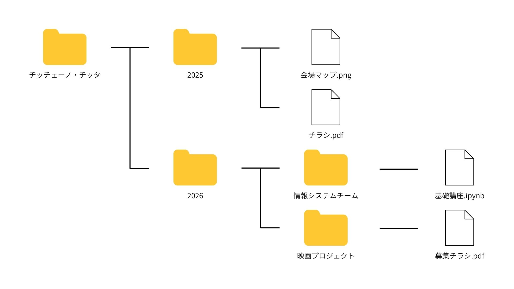

# ファイル操作

## エクスプローラーの設定変更

`エクスプローラー > 表示 > 表示` を開き、以下の3つにチェックが入った状態にする。

- 項目チェックボックス
- ファイル名拡張子
- 隠しファイル


## 基礎知識

### フォルダ構成

フォルダ・ファイルは以下のような入れ子構造になっている。



上のフォルダ構成をテキストで以下のように表すこともある。

```
チッチェーノ・チッタ
├─2025
│　├─会場マップ.png
│　└─チラシ.pdf
└─2026
 　├─情報システムチーム
 　│　└─基礎講座.ipynb
 　└─映画プロジェクト
 　 　└─募集チラシ.pdf
```

今後は簡略のためにこの表記で統一する。

### パス

特定のファイルへのアドレスを **パス** という形式で表すことがある。
上の例において、 *募集チラシ.pdf* は `チッチェーノ・チッタ/2026/映画プロジェクト/募集チラシ.pdf` となる。

このページへのリンク(`https://cicceno-citta.github.io/starter/2026/PC基礎講座&顔合わせ/PC基礎講座/ファイル操作.html`)の後半部分(`starter/2026/PC基礎講座&顔合わせ/PC基礎講座/ファイル操作.html`)もパスである。

### Windowsのフォルダ構成

Windowsを使用している場合、デフォルトで以下のようなフォルダ構成が存在する。

```
C:
├─Users
│　├─(ユーザー名)
│　│　├─Downloads
│　│　├─Desktop
│　│　├─Documents
│　│　├─Pictures
│　│　├─Videos
│　│　├─Music
```

この例において、`C:`を **ドライブレター** といい、ドライブレターから始まるパスを **絶対パス** と呼ぶ。`Downloads`フォルダへの絶対パスは `C:\Users\(ユーザー名)\Downloads` である。

絶対パスは、エクスプローラーのアドレスバーからコピー、また入力することでそのファイルに移動することができる。


## 新規作成

`右クリック > 新規作成` で作成するファイルの種類を選択する。


## コピー・切り取り・貼り付け(ペースト)

テキストと同様にコピー・切り取り・貼り付けを利用できる。


## 名前の変更

ファイル名を変更する。

ファイルを選択した状態で `右クリック > 名前の変更` をクリックし、変更後のファイル名を入力する。

拡張子を変更してしまうと、ファイルの種類を判別できなくなってしまうため注意が必要。

## 名前を付けて保存

ソフトウェアからファイルを保存する際のダイアログ。

1. 保存するフォルダを開く
2. ファイル名を入力する
3. **保存** をクリックする


## ファイルを開く

ソフトウェアからファイルを開く際のダイアログ。

1. 開きたいファイルが存在するフォルダを開く
2. ファイルを選択する
3. **開く** をクリックする


## 展開

ダウンロードして保存したファイルの拡張子が`.zip`等なことがある。この場合、このファイルは圧縮されているので、展開する必要がある。

ファイルを選択した状態で `右クリック > すべて展開` をクリックする。

## 演習

新しいフォルダを作成し、名前を自分の名前にする。

以下のファイルを `ダウンロードフォルダ` に保存し、展開する。
[サンプル.zip](attachments/サンプル.zip)

展開したフォルダ内のファイルを作成したフォルダ内に移動させる。
移動させる方法はいくつかあるが、最終的に作成したフォルダ内にファイルがあれば、いずれでも構わない。

作成したフォルダを以下にアップロードする。
https://drive.google.com/drive/folders/1uKca3837PFl7RnKoj4oGJYKLEfDIh0io?usp=sharing